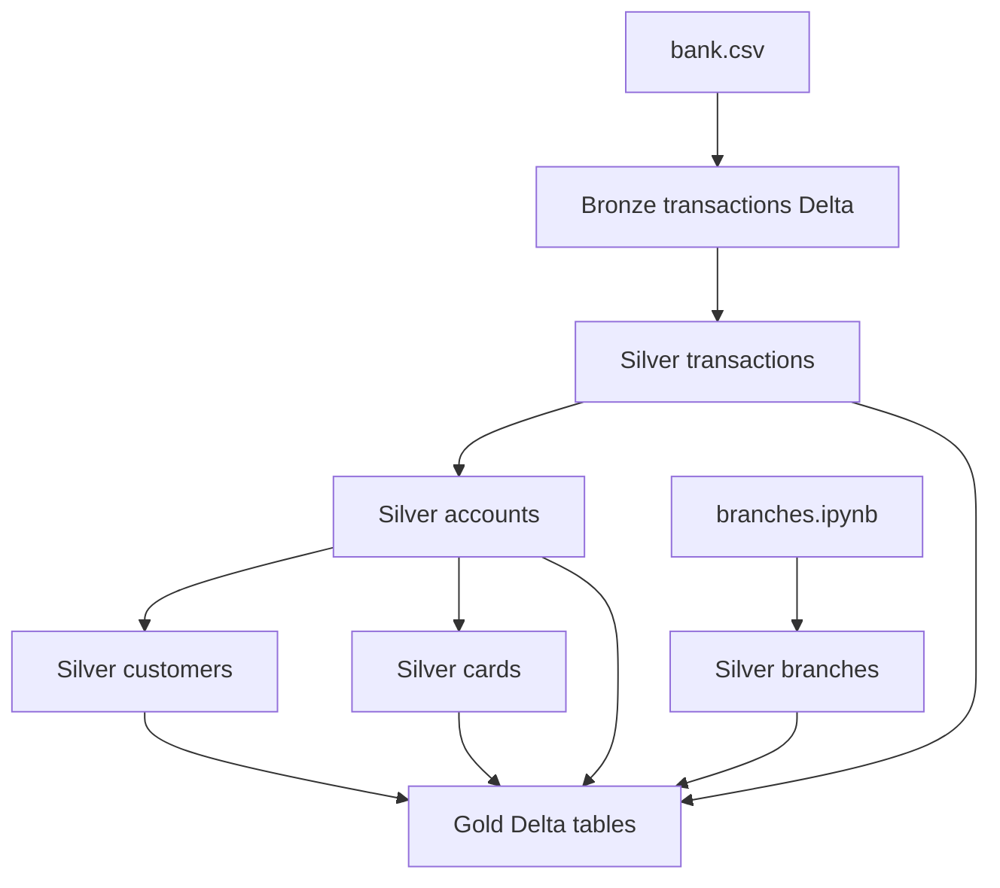

# Banking Transactions Lakehouse (Selected Dataset Edition)

This repository implements a **medallion (Bronze → Silver → Gold)** lakehouse for a **selected banking transactions dataset**. Data is processed with **Apache Spark (PySpark)** on **Databricks**, persisted as **Delta Lake** under a Unity Catalog **volume** layout (`bronze/`, `delta/bronze|silver|gold/`, `schemas/`). Consumption-layer SQL in `sql/SQL_queries.sql` targets the **Gold** Delta tables.

Repository: [Siddhardha2330/Banking-Transactions-Lakehouse-Project-Selected-Dataset-Edition](https://github.com/Siddhardha2330/Banking-Transactions-Lakehouse-Project-Selected-Dataset-Edition)

## Architecture

The design follows a classic **three-layer lakehouse**:

1. **Bronze** — Land the source CSV with minimal transformation: column-name cleanup and Delta persistence (and optionally **Auto Loader** / schema evolution via pipeline code). Bronze preserves the grain of the raw bank statement extract.
2. **Silver** — Conform the transaction stream (types, dates, amounts, deduplication, quality checks), then derive **dimensions** (accounts, customers, branches, cards) so facts and dimensions share stable keys suitable for joins.
3. **Gold** — Publish **curated** Delta tables (`transactions`, `accounts`, `customers`, `branches`, `cards`) used for analytics, dashboards, and the join patterns in `sql/SQL_queries.sql`.

**Orchestration** — `notebooks/mast.ipynb` expresses the layer order (Bronze notebook, then `silver_transform`, then `gold_transform`) as a single pipeline story. **Notebooks** under `bronze/`, `silver/`, and `gold/` hold the imperative PySpark logic; **`notebooks/pipeline_files/`** holds a declarative-style module for Bronze using Spark **pipelines** (`@dp.table`) and **cloudFiles** (Auto Loader), with `silver_transactions.py` reserved as a **placeholder** for a matching Silver pipeline definition.

**Analytics** — `sql/SQL_queries.sql` defines a wide **base dataset** joining Gold `transactions` to `accounts`, `customers`, `branches`, and `cards`, plus KPI-style fragments (counts, credit/debit sums, trends by date, branch and card slices). Those queries assume the Gold schemas below.

Branches are **reference data** built in `branches.ipynb` (fixed seed rows), not extracted from the bank CSV. Gold holds the curated entity tables that `sql/SQL_queries.sql` joins for reporting.

## Storage layout (logical)

Paths in notebooks are rooted at a volume such as  
`/Volumes/workspace/default/banking-transactions-lakehouse-project-selected-dataset-edition/`.

| Area | Typical Delta path | Role |
|------|-------------------|------|
| Bronze ingest file | `.../bronze/bank.csv` | Source CSV |
| Bronze table | `.../delta/bronze/transactions` | Raw-normalized statement rows |
| Auto Loader schema | `.../schemas/bronze` | Schema inference / evolution location (pipeline variant) |
| Silver facts | `.../delta/silver/transactions` | Cleaned transaction fact table |
| Silver dimensions | `.../delta/silver/{accounts,customers,branches,cards}` | Conformed dimensions |
| Gold | `.../delta/gold/{transactions,accounts,customers,branches,cards}` | Curated tables for BI / SQL |

## Schema by layer

### Bronze (`transactions`)

Mirrors the CSV after header-based load and **column renaming** (spaces and punctuation normalized). Conceptually includes:

- **Account_No** → later **Account_No** / `Account_No` (string)  
- **DATE**, **TRANSACTION DETAILS**, **CHQ.NO.**, **VALUE DATE**  
- **WITHDRAWAL AMT**, **DEPOSIT AMT**, **BALANCE AMT** (often ingested as string, then cleaned downstream)  
- Spurious trailing column from the file is dropped in Silver.

### Silver — `transactions`

Produced by `silver_transform.ipynb` from Bronze Delta:

| Column | Meaning |
|--------|--------|
| `account_id` | Account identifier (from statement `Account_No`) |
| `transaction_date` | Parsed `date` |
| `amount` | Numeric movement (deposit amount if present, else withdrawal) |
| `transaction_type` | `credit` or `debit` |
| `balance` | Running balance after the line (numeric) |

Intermediate steps use `transaction_details`, `value_date`, `withdrawal_amount`, `deposit_amount` until the final projection.

### Silver — `accounts`

Built from Silver `transactions` using a **window** (latest row per `account_id`):

| Column | Meaning |
|--------|--------|
| `account_id` | Primary key |
| `latest_balance` | Balance on the latest `transaction_date` |
| `account_type` | Constant `Savings` in the reference implementation |
| `branch_id` | `B1`–`B4`, derived from `account_id` (hash bucketing) |

### Silver — `branches`

Small **reference** dimension (explicit schema):

| Column | Meaning |
|--------|--------|
| `branch_id` | `B1` … `B4` |
| `branch_name` | e.g. Main Branch, Central Branch |
| `city` | e.g. Hyderabad, Mumbai, Delhi, Chennai |

### Silver — `customers`

Derived from Silver `accounts`:

| Column | Meaning |
|--------|--------|
| `customer_id` | Same as `account_id` (synthetic 1:1 customer per account) |
| `account_id` | FK to accounts |
| `customer_name` | `Customer_<account_id>` |
| `city` | Synthetic city from hash buckets (Hyderabad, Mumbai, etc.) |

### Silver — `cards`

One row per account, from Silver `accounts`:

| Column | Meaning |
|--------|--------|
| `card_id` | `C_` + `account_id` |
| `account_id` | FK to accounts |
| `card_type` | `Debit` or `Credit` (randomized in the sample generator) |

### Gold

Gold tables align with the **same business entities** as Silver (`transactions`, `accounts`, `customers`, `branches`, `cards`) and are what `sql/SQL_queries.sql` references for joins and KPI-style aggregations (e.g. `transaction_date`, `amount`, `transaction_type`, `balance` on facts; `latest_balance`, `account_type` on accounts; `customer_name`, `city` on customers; `branch_name`, `city` on branches; `card_type` on cards).

**Relationship summary (Gold / SQL join model):**  
`transactions.account_id` → `accounts.account_id`; `accounts.account_id` → `customers.account_id`; `accounts.branch_id` → `branches.branch_id`; `cards.account_id` → `accounts.account_id` (left join where card may not apply to every analytic).

## Repository structure

| Path | Description |
|------|-------------|
| `notebooks/bronze/bronze_load.ipynb` | Batch Bronze load: CSV read, column cleanup, Delta write to `delta/bronze/transactions`. |
| `notebooks/silver/silver_transform.ipynb` | Silver **fact** pipeline: Bronze → typed amounts, `transaction_type`, dates, validation, `delta/silver/transactions`. |
| `notebooks/silver/accounts.ipynb` | Silver **accounts** dimension from transaction history + synthetic branch assignment. |
| `notebooks/silver/branches.ipynb` | Silver **branches** reference data. |
| `notebooks/silver/cards.ipynb` | Silver **cards** dimension tied to accounts. |
| `notebooks/silver/customers.ipynb` | Silver **customers** dimension tied to accounts. |
| `notebooks/silver/README.md` | Minimal placeholder in folder. |
| `notebooks/gold/gold_transform.ipynb` | Gold layer: curated Delta tables for downstream use. |
| `notebooks/mast.ipynb` | High-level orchestration across Bronze, Silver transform, and Gold notebooks. |
| `notebooks/pipeline_files/bronze_transactions.py` | Declarative Bronze **table** definition: Auto Loader (`cloudFiles`) from `bank.csv`, schema location under `schemas/bronze`, column sanitization; intended for DLT / Spark pipelines style workloads. |
| `notebooks/pipeline_files/silver_transactions.py` | Empty file: placeholder for a Silver pipeline module mirroring the Bronze pattern. |
| `sql/SQL_queries.sql` | Analytical SQL: wide join across Gold tables, KPI templates, time / branch / card breakdowns. |
| `docs/` | Written project material, including *Banking Transactions Lakehouse Project Guide (3).pdf*. |
| `screenshots/` | Evidence of layers and analytics: Bronze layer, Silver table samples, KPIs, business aggregations, ranking/running totals, final report table, **Dashboard Analytics** (images 1–7 plus `Dashboard Analytics 8.jpeg`). |

Together, the folders separate **executable pipelines** (`notebooks/`), **reusable pipeline modules** (`notebooks/pipeline_files/`), **declarative analytics** (`sql/`), **narrative documentation** (`docs/`), and **visual proof** (`screenshots/`) of the lakehouse behavior on the selected dataset.
